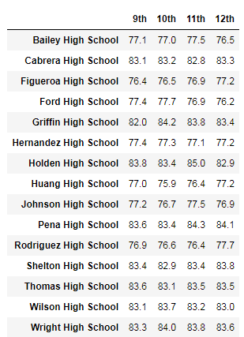
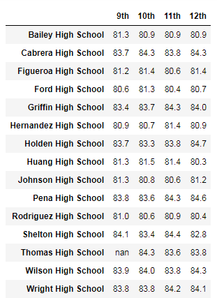
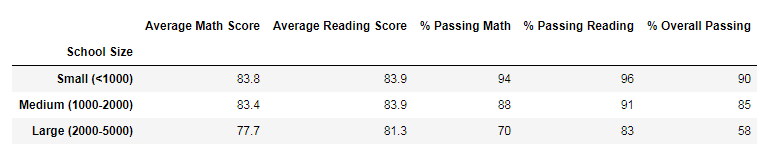

# School_District_Analysis

## Project Overview
Maria a data scientist for City School District has requested us to analyze reading and math scores for the high schools in the district. Following deliverables were requested as part of the project.
  - A high-level snapshot of the district's key metrics, presented in a table format
  - An overview of the key metrics for each school, presented in a table format
  - Tables presenting each of the following metrics:
    - Top 5 and bottom 5 performing schools, based on the overall passing rate
    - The average math score received by students in each grade level at each school
    - The average reading score received by students in each grade level at each school
    - School performance based on the budget per student
    - School performance based on the school size 
    - School performance based on the type of school

## resources
- Data Source: schools_complete.csv, students_complete.csv
- Software: anaconda3, python 3.7.7, jupyter notebook

## Summary
  - District's key metrics
   
  
  - Key metrics for each school
   
  
  
  - Additional Metrics:
    - Top 5 performing schools, based on the overall passing rate
     
    
    - Bottom 5 performing schools, based on the overall passing rate
     
    
    
    - The average math score received by students in each grade level at each school
     
    
    - The average reading score received by students in each grade level at each school
     
    
    
    - School performance based on the budget per student
     
    
    - School performance based on the school size 
     
    
    - School performance based on the type of school
     
  
  

Once all the deliverables were presented, we were informed that there was a mistake.

The school board has notified Maria and her supervisor that the students_complete.csv file shows evidence of academic dishonesty; specifically, reading and math grades for Thomas High School ninth graders appear to have been altered. Although the school board does not know the full extent of the academic dishonesty, they want to uphold state-testing standards and have turned to Maria for help. She has asked you to replace the math and reading scores for Thomas High School with NaNs while keeping the rest of the data intact.

So she has requested us to replace the math and reading scores, and once that is done, she asked us to repeat the school district analysis with the updated data, and write up a report to describe how these changes affected the overall analysis.

## Challenge Overview
Replace math and reading scores for Thomas High School 9th grade with 'NaN' and repeat the analysis and provide the same deliverables as above and answer the following questions.

## Challenge Summary
  - District's key metrics
   
  
  - Key metrics for each school
   
  
  
  - Additional Metrics:
    - Top 5 performing schools, based on the overall passing rate
     
    
    - Bottom 5 performing schools, based on the overall passing rate
     
    
    
    - The average math score received by students in each grade level at each school
     
    
    - The average reading score received by students in each grade level at each school
     
    
    
    - School performance based on the budget per student
     
    
    - School performance based on the school size 
     
    
    - School performance based on the type of school
     

## Comparison
  - How is the district summary affected?
   
   
   
   After removing 9th grade math and reading grades for Thomas High School, there was almost no effect on the average math and reading scores, however % passing in math, reading, and overall went down by 1.
   
   
  - How is the school summary affected?
   
   
   
   There is not much change in average math and reading scores, however the % math passing fell by 26%, % reading passing fell by 27%, and % overall passing fell by 26%.
   
   
  - How does replacing the ninth graders’ math and reading scores affect Thomas High School’s performance relative to the other schools?
   
   
   
   
   
   
   
  - How does replacing the ninth-grade scores affect the following:
    - Math and reading scores by grade
      1) Math:
        
        
        
      2) Reading:
        
        
        
    - Scores by school spending
     
     
     
    - Scores by school size
     
     
     
    - Scores by school type
     
     
     
